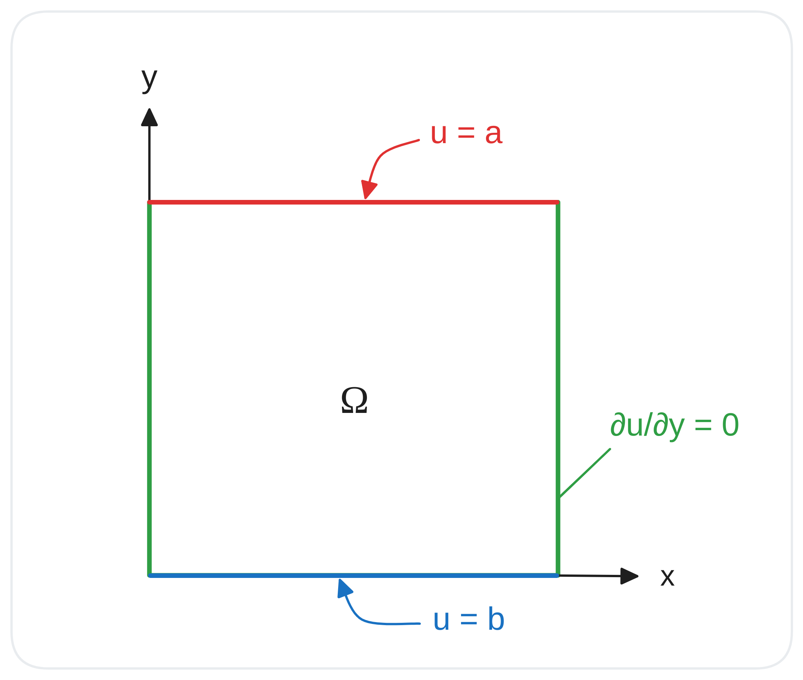

# Boundary Conditions

Using [Chmy.jl](https://github.com/PTsolvers/Chmy.jl), we aim to study partial differential equations (PDEs) arising from physical or engineering problems. Generally, PDEs possess infinitely many solutions. Therefore, to obtain a unique solution, additional initial or boundary conditions are necessary for the model problem to be well-posed, ensuring the existence and uniqueness of a stable solution.

We provide a small overview for boundary conditions that one often encounter. Followingly, we consider the unknown function $u : \Omega \mapsto \mathbb{R}$ defined on some  bounded computational domain $\Omega \subset \mathbb{R}^d$ in a $d$-dimensional space. With the domain boundary denoted by $\partial \Omega$, we have some function $g : \partial \Omega \mapsto \mathbb{R}$ prescribed on the boundary.


| Type    | Form | Example |
|:------------|:------------|:---------|
| Dirichlet | $u = g$ on $\partial \Omega$ | In fluid dynamics, the no-slip condition for viscous fluids states that at a solid boundary the fluid has zero velocity relative to the boundary. |
| Neumann | $\partial_\nu u = g$ on $\partial \Omega$, where $\nu$ is the outer normal vector to $\Omega$ | It specifies the values in which the derivative of a solution is applied within the boundary of the domain. An application in thermodynamics is a prescribed heat flux from a surface, which serves as boundary condition |
| Robin  |  $u + \alpha \partial_\nu u = g$ on $\partial \Omega$, where $\alpha \in \mathbb{R}$.  | Also called impedance boundary conditions from their application in electromagnetic problems |


## Applying Boundary Conditions

Followingly, we describe the syntax in [Chmy.jl](https://github.com/PTsolvers/Chmy.jl) for launching kernels that impose boundary conditions on some `field` that is well-defined on a `grid` with backend specified through `arch`. For Dirichlet and Neumann boundary conditions, they are referred to as homogeneous if $g = 0$, otherwise they are non-homogeneous if $g = v$ holds, for some $v\in \mathbb{R}$.

|     | Homogeneous | Non-homogeneous |
|:------------|:------------|:------------|
| Dirichlet | `bc!(arch, grid, field => Dirichlet())` | `bc!(arch, grid, field => Dirichlet(v))` |
| Neumann | `bc!(arch, grid, field => Neumann())` | `bc!(arch, grid, field => Neumann(v))` |


### Batched Boundary Conditions

For better performance considerations, one could also combine the application of boundary conditions with kernels dedicated to field updates by using batched boundary conditions.

Given a 2D vector field `V`, we specify boundary conditions imposed on `V.x` and `V.y` as a tuple `bc_V`.

```julia
# specify for both V.x and V.y fields
bc_V = (V.x => (x=Dirichlet(), y=Neumann()),
        V.y => (x=Neumann(), y=Dirichlet()))
```

When using `launch` to specify the execution of a kernel, one can pass the specified boundary conditions as an optional parameter using `batch`, provided the grid information of the discretized space.

```julia
launch(arch, grid, update_velocity! => (V, r_V, Pr, τ, ρgy, η_ve, νdτ, grid); bc=batch(grid, bc_V...))
```

Using this syntax, we avoid redundant kernel launches and gain efficiency from making good use of already cached values used in field updates.

### Mixed Boundary Conditions

In the code example above, by specifying boundary conditions using syntax such as `field => Neumann()`, we essentially launch a kernel that impose the Neumann boundary condition on the entire domain boundary $\partial \Omega$. More often, one may be interested in prescribing different boundary conditions on different parts of $\partial \Omega$.


The following figure showcases a 2D square domain $\Omega$ with different boundary conditions applied on each side:

- The top boundary (red) is a Dirichlet boundary condition where $u = a$.
- The bottom boundary (blue) is also a Dirichlet boundary condition where $u = b$.
- The left and right boundaries (green) are Neumann boundary conditions where $\frac{\partial u}{\partial y} = 0$.


```@raw html

```

To launch a kernel that satisfies these boundary conditions in Chmy.jl, you can use the following code:

```julia
bc!(arch, grid, field => (x = Neumann(), y = (Dirichlet(b), Dirichlet(a))))
```