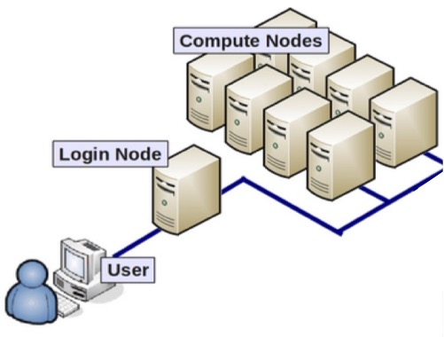

# Distributed

**Task-based parallelism** in [Chmy.jl](https://github.com/PTsolvers/Chmy.jl) is featured by the usage of [`Threads.@spawn`](https://docs.julialang.org/en/v1/base/multi-threading/#Base.Threads.@spawn), with an additional layer of a [Worker](../developer_documentation/workers.md) construct for efficiently managing the lifespan of tasks. Note that the task-based parallelism provides a high-level abstraction of program execution **not only** for **shared-memory architecture** on a single device, but it can be also extended to **hybrid parallelism**, consisting of both shared and distributed-memory parallelism. The `Distributed` module in Chmy.jl allows users to leverage the hybrid parallelism through the power of abstraction.

We will start with some basic background knowledge for understanding the architecture of modern HPC clusters, the underlying memory model and the programming paradigm complied with it.

## HPC Cluster & Distributed Memory

An **high-performance computing (HPC)** cluster consists of a **network** of independent computers combined into a system through specialised hardware. We call each computer a *node*, and each node manages its own private memory. Such system with interconnected nodes, without having access to memory of any other node, features the **distributed memory model**. The underlying fast interconnect architecture (e.g. *InfiniBand*) that physically connects the nodes in the **network** can transfer the data from one node to another in an extremely efficient manner.

```@raw html
<center>
    
</center>
```

By using the fast interconnection, processes across different nodes can communicate with each other through the exchange of messages in a high-throughput, low-latency fashion. The syntax and semantics of how **message passing** should proceed through such network is defined by a standard called the **Message-Passing Interface (MPI)**, and there are different libraries that implement the standard, resulting in a wide range of choice (MPICH, Open MPI, MVAPICH etc.) for users. [MPI.jl](https://github.com/JuliaParallel/MPI.jl) package provides a high-level API for Julia users to call library routines of an implementation of user's choice.


!!! info "Message-Passing Interface (MPI) is a General Specification"
    In general, implementations based on **MPI standard** can be used for a great variety of computers, not just on HPC clusters, as long as these computers are connected by a communication network.

## Distributed Architecture

Expanding upon our understanding of message passing in HPC clusters, we now turn our focus to its application within GPU-enhanced environments in Chmy.jl. Our distributed architecture builds upon the abstraction of having GPU clusters that build on the same GPU architecture. Note that in general, GPU clusters may be equipped with hardware from different vendors, incorporating different types of GPUs to exploit their unique capabilities for specific tasks.

!!! warning "GPU-Aware MPI Required for Distributed Module on GPU backend"
    The `Distributed` module currently only supports [GPU-aware MPI](https://juliaparallel.org/MPI.jl/stable/usage/#CUDA-aware-MPI-support) when a GPU backend is selected for multi-GPU computations. For the `Distributed` module to function properly, any GPU-aware MPI library installation shall be used. Otherwise, a segmentation fault will occur.
