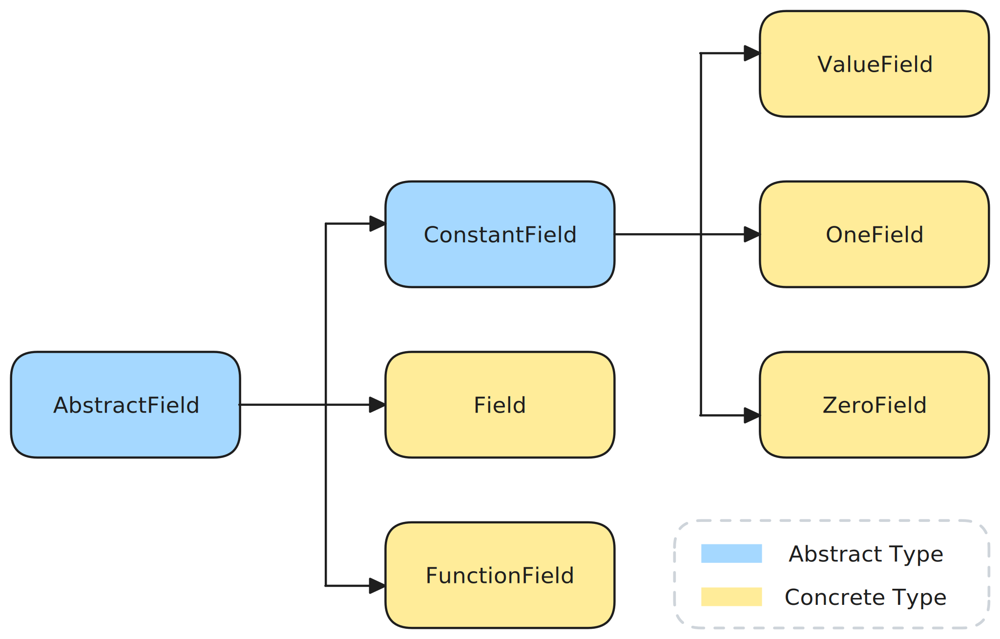

# Fields


With a given grid representing a known location spanning `N` dimensional space, we abstract the data structure on the grid under the concept `AbstractField`. Following is the typetree of the abstract field and its derived data types.

```@raw html

```


## Defining a multi-dimensional `Field`

Consider the following example, where we predefined a variable `grid` of type `Chmy.UniformGrid`, similar as in the previous section [Grids](./grids.md). We can now define physical properties on the grid.

When defining a scalar field `Field` on the grid, we need to specify the arrangement of the field values. These values can either be stored at the cell centers of each control volume `Center()` or on the cell vertices/faces `Vertex()`.

```julia
# Define geometry, architecture..., a 2D grid
grid   = UniformGrid(arch; origin=(-lx/2, -ly/2), extent=(lx, ly), dims=(nx, ny))

# Define pressure as a scalar field
Pr    = Field(backend, grid, Center())
```


```julia
# Define velocity as a vector field on the 2D grid
V     = VectorField(backend, grid)

# Define stress as a tensor field on the 2D grid
τ     = TensorField(backend, grid)
```

With the methods `VectorField` and `TensorField`, we can conveniently construct 2-dimensional and 3-dimensional fields, with predefined locations for each field dimension on a staggered grid.

## Defining a parameterized `FunctionField`

A field could also be represented in a parameterized way, having a function that associates a single number to every point in the space.

`Discrete`
`Continuous`


```bash
julia> Chmy.Fields.
                          
LocOrLocs                                      
                        _expand               _loc_string           _params
_set_continuous!      _set_discrete!        _set_field!           call_func             cpu__set_continuous!
cpu__set_discrete!    cpu__set_field!       divg                  eval                  func_type
gpu__set_continuous!  gpu__set_discrete!    gpu__set_field!       halo                  include
interior              location              set!                  vector_location
```


## Defining Constant Fields

For completeness, we also provide an abstract type `ConstantField`, which comprises of a generic `ValueField` type, and two special types `ZeroField`, `OneField` for conveninent usage. With such a construct, we can easily define value fields properties and other parameters using constant values in a straightforward and readable manner. Moreover, explicit information about the grid on which the field should be defined can be abbreviated. For example:

```julia
# Defines a field with constant values 1.0
field = Chmy.ValueField(1.0)
```

Alternatively, we could also use the conveninent and lightweight contructor.

```julia
# Defines a field with constant value 1.0 using the convenient constructor
onefield = Chmy.OneField{Float64}()
```

Notably, these two fields shall equal to each other as expected.

```julia
julia> field == onefield
true
```

## TODO:


location, halo, interior, set!
divg


### Boundary Conditions on Distributed Fields

On a distributed architecture, we could offload the workload to be performed on a grid into distributed workload on subgrids.

TODO: 
TODO: add `exchange_halo!`