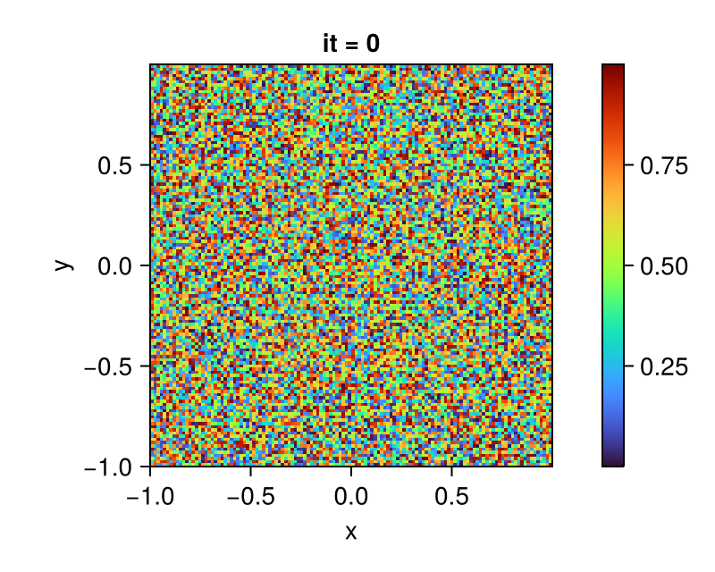

# Fields

With a given grid that allows us to define each point uniquely in a high-dimensional space, we abstract the data values to be defined on the grid under the concept `AbstractField`. Following is the type tree of the abstract field and its derived data types.

```@raw html

```

## Defining a multi-dimensional `Field`

Consider the following example, where we predefined a variable `grid` of type `Chmy.UniformGrid`, similar as in the previous section [Grids](./grids.md). We can now define physical properties on the grid.

When defining a scalar field `Field` on the grid, we need to specify the arrangement of the field values. These values can either be stored at the cell centers of each control volume `Center()` or on the cell vertices/faces `Vertex()`.

```julia
# Define geometry, architecture..., a 2D grid
grid = UniformGrid(arch; origin=(-lx/2, -ly/2), extent=(lx, ly), dims=(nx, ny))

# Define pressure as a scalar field
Pr   = Field(backend, grid, Center())
```

With the methods `VectorField` and `TensorField`, we can conveniently construct 2-dimensional and 3-dimensional fields, with predefined locations for each field dimension on a staggered grid.

```julia
# Define velocity as a vector field on the 2D grid
V = VectorField(backend, grid)

# Define stress as a tensor field on the 2D grid
τ = TensorField(backend, grid)
```

!!! tip "Acquiring Locations on the Grid Cell"
    One could use a convenient getter for obtaining locations of variable on the staggered-grid. Such as `Chmy.location(Pr)` for scalar-valued pressure field and `Chmy.location(τ.xx)` for a tensor field.

### Setup Initial Conditions on `Field`

We could also modify field values in order to set up initial conditions on the values. We first have an empty field variable `C` defined, by using `interior(C)` we can inspect its values being empty equal to zero.

```julia
C = Field(backend, grid, Center())
```

```julia
# Set initial values of the field randomly
set!(C, grid, (_, _) -> rand())

# Set initial values to 2D Gaussian
set!(C, grid, (x, y) -> exp(-x^2 - y^2))
```

```@raw html

```

```@raw html

```


A slightly more complex usage involves passing extra parameters to be used for initial conditions setup.

```julia
# Define a temperature field with values on cell centers
T = Field(backend, grid, Center())

# Function for setting up the initial conditions on T
init_incl(x, y, x0, y0, r, in, out) = ifelse((x - x0)^2 + (y - y0)^2 < r^2, in, out)

# Set up the initial conditions with parameters specified
set!(T, grid, init_incl; parameters=(x0=0.0, y0=0.0, r=0.1lx, in=T0, out=Ta))
```

## Defining a parameterized `FunctionField`

A field could also be represented in a parameterized way, having a function that associates a single number to every point in the space.

An object of the concrete type `FunctionField` can be initialized with its constructor. The constructor takes in 


1. A function `func`
2. A `grid`
3. A location tuple `loc` for specifying the distribution of variables

Optionally, one can also use the boolean variable `discrete` to indicate if the function field is typed `Discrete` or `Continuous`. Any additional parameters to be used in the function `func` can be passed to the optional parameter `parameters`.

### Example: Creation of a parameterized function field
Followingly, we create a `gravity` variable that is two-dimensional and comprises of two parameterized `FunctionField` objects on a predefined uniform grid `grid`.

**1. Define Functions that Parameterize the Field**

In this step, we specify how the gravity field should be parameterized in x-direction and y-direction, with `η` as the additional parameter used in the parameterization.

```julia
# forcing terms
ρgx(x, y, η) = -0.5 * η * π^2 * sin(0.5π * x) * cos(0.5π * y)
ρgy(x, y, η) = 0.5 * η * π^2 * cos(0.5π * x) * sin(0.5π * y)
```

**2. Define Locations for Variable Positioning**

We specify the location on the fully-staggered grid as introduced in the _Location on a Grid Cell_ section of the concept [Grids](./grids.md).

```julia
vx_node = (Vertex(), Center())
vy_node = (Center(), Vertex())
```

**3. Define the 2D Gravity Field**

By specifying the locations on which the parameterized field should be calculated, as well as concretizing the value `η = η0` by passing it as the optional parameter `parameters` to the constructor, we can define the 2D gravity field:

```julia
η0 = 1.0
gravity = ( x=FunctionField(ρgx, grid, vx_node; parameters=η0),
            y=FunctionField(ρgy, grid, vy_node; parameters=η0))
```

## Defining Constant Fields

For completeness, we also provide an abstract type `ConstantField`, which comprises of a generic `ValueField` type, and two special types `ZeroField`, `OneField` for conveninent usage. With such a construct, we can easily define value fields properties and other parameters using constant values in a straightforward and readable manner. Moreover, explicit information about the grid on which the field should be defined can be abbreviated. For example:

```julia
# Defines a field with constant values 1.0
field = Chmy.ValueField(1.0)
```

Alternatively, we could also use the conveninent and lightweight contructor.

```julia
# Defines a field with constant value 1.0 using the convenient constructor
onefield = Chmy.OneField{Float64}()
```

Notably, these two fields shall equal to each other as expected.

```julia
julia> field == onefield
true
```