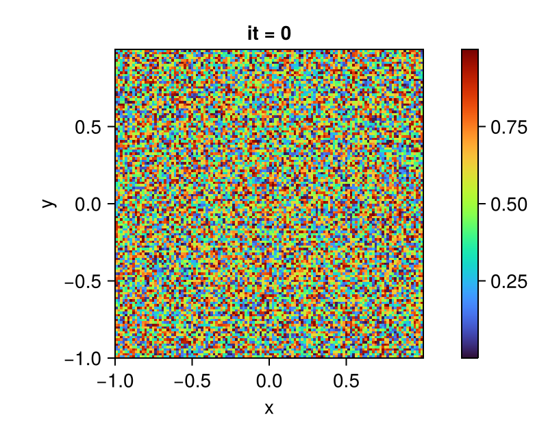
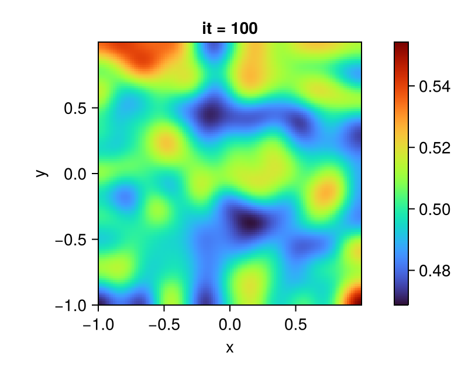

# Getting Started with Chmy.jl

[Chmy.jl](https://github.com/PTsolvers/Chmy.jl) is a backend-agnostic toolkit for finite difference computations on multi-dimensional computational staggered grids. In this introductory tutorial, we will showcase the essence of Chmy.jl by solving a simple 2D diffusion problem. The full code of the tutorial material is available under [diffusion_2d.jl](https://github.com/PTsolvers/Chmy.jl/blob/main/examples/diffusion_2d.jl).

## Basic Diffusion

The diffusion equation is a second order parabolic PDE, here for a multivariable function $C(x,y,t)$ that represents the field being diffused (such as the temperature or the concentration of a chemical component in a solution) showing derivatives in both temporal $\partial t$ and spatial $\partial x$ dimensions, where $\chi$ is the diffusion coefficient. In 2D we have the following formulation for the diffusion process:

```math
\begin{equation}
\frac{\partial C}{\partial t} = \chi \left( \frac{\partial^2 C}{\partial x^2} + \frac{\partial^2 C}{\partial y^2} \right).
\end{equation}
```

Introducing the diffusion flux $q$, we can rewrite equation `(1)` as a system of two PDEs, consisting of equations `(2)` and `(3)`.

```math
\begin{equation}
\boldsymbol{q} = -\chi \nabla C~,
\end{equation}
```

```math
\begin{equation}
\frac{\partial C}{\partial t} = - \nabla \cdot \boldsymbol{q}~.
\end{equation}
```

### Boundary Conditions

Generally, partial differential equations (PDEs) require initial or [boundary conditions](./concepts/bc.md) to ensure a unique and stable solution. For the field `C`, a Neumann boundary condition is given by:

```math
\begin{equation}
\frac{\partial C}{\partial \boldsymbol{n}} = g(x, y, t)
\end{equation}
```
where $\frac{\partial C}{\partial \boldsymbol{n}}$ is the derivative of `C` normal to the boundary, and $g(x, y, t)$ is a given function. In this tutorial example, we consider a homogeneous Neumann boundary condition, $g(x, y, t) = 0$, which implies that there is no flux across the boundary.

## Using Chmy.jl for Backend Portable Implementation

As the first step, we need to load the main module and any necessary submodules of [Chmy.jl](https://github.com/PTsolvers/Chmy.jl). Moreover, we use [KernelAbstractions.jl](https://github.com/JuliaGPU/KernelAbstractions.jl) for writing backend-agnostic kernels that are compatible with Chmy.jl.

```julia
using Chmy, Chmy.Architectures, Chmy.Grids, Chmy.Fields, Chmy.BoundaryConditions, Chmy.GridOperators, Chmy.KernelLaunch
using KernelAbstractions # for backend-agnostic kernels
using Printf, CairoMakie # for I/O and plotting
# using CUDA
# using AMDGPU
```

In this introductory tutorial, we will use the CPU backend for simplicity:

```julia
arch = Arch(CPU())
```

If a different backend is desired, one needs to load the relevant package accordingly. For example, if Nvidia or AMD GPUs are available, one can comment out `using CUDA` or `using AMDGPU` and make sure to use `arch = Arch(CUDABackend())` or `arch = Arch(ROCBackend())`, respectively, when selecting the architecture. For further information about executing on a single-device or multi-device architecture, see the documentation section for [Architectures](./concepts/architectures.md)

## Writing & Launch Compute Kernels

We want to solve the system of equations `(2)` & `(3)` numerically. We will use the explicit forward [Euler method](https://en.wikipedia.org/wiki/Euler_method) for temporal discretization and [finite-differences](https://en.wikipedia.org/wiki/Finite_difference) for spatial discretization. Accordingly, the kernels for performing the arithmetic operations for each time step can be defined as follows:

```julia
@kernel inbounds = true function compute_q!(q, C, χ, g::StructuredGrid, O)
    I = @index(Global, Cartesian)
    I = I + O
    q.x[I] = -χ * ∂x(C, g, I)
    q.y[I] = -χ * ∂y(C, g, I)
end
```

```julia
@kernel inbounds = true function update_C!(C, q, Δt, g::StructuredGrid, O)
    I = @index(Global, Cartesian)
    I = I + O
    C[I] -= Δt * divg(q, g, I)
end
```

!!! note "Non-Cartesian indices"
    You can use not only `Cartesian` indices, but more usual "subscript" indices as well. For example, `update_C!` will become:
    ```julia
    @kernel inbounds = true function update_C!(C, q, Δt, g::StructuredGrid, O)
        ix, iy = @index(Global, NTuple)
        (ix, iy) = (ix, iy) + O
        C[ix, iy] -= Δt * divg(q, g, ix, iy)
    end
    ```

## Model Setup

The diffusion model that we solve should contain the following model setup

```julia
# geometry
grid   = UniformGrid(arch; origin=(-1, -1), extent=(2, 2), dims=(126, 126))
launch = Launcher(arch, grid)
# physics
χ = 1.0
# numerics
Δt = minimum(spacing(grid))^2 / χ / ndims(grid) / 2.1
```

In the 2D problem only three physical fields, the field `C` and the diffusion flux `q` in `x`- and `y`-dimension are evolving with time. We define these fields on different locations on the staggered grid (more see [Grids](./concepts/grids.md)).

```julia
# allocate fields
C = Field(backend, grid, Center())
q = VectorField(backend, grid)
```

We randomly initialized the entries of `C` field and finished the initial model setup. One can refer to the section [Fields](./concepts/fields.md) for setting up more complex initial conditions.

```julia
# initial conditions
set!(C, grid, (_, _) -> rand())
bc!(arch, grid, C => Neumann(); exchange=C)
```

```@raw html
<div style="text-align: center;">
    
</div>
```

## Solving Time-dependent Problem

We are resolving a time-dependent problem, so we explicitly advance our solution within a time loop, specifying the number of iterations (or time steps) we desire to perform. The action that takes place within the time loop is the variable update that is performed by the compute kernels `compute_q!` and `update_C!`, accompanied by the imposing the Neumann boundary condition on the `C` field.

```julia
# action
nt = 100
for it in 1:nt
    @printf("it = %d/%d \n", it, nt)
    launch(arch, grid, compute_q! => (q, C, χ, grid))
    launch(arch, grid, update_C! => (C, q, Δt, grid); bc=batch(grid, C => Neumann(); exchange=C))
end
```

After running the simulation, you should see something like this, here the final result at `it = 100` for the field `C` is plotted.

```@raw html
<div style="text-align: center;">
    
</div>
```
